# VLSI ALU Project — Sklansky Adder

A 4-bit ALU (`Y = A + B - C`) built **full-custom** in Cadence Virtuoso around a
4-bit **Sklansky parallel-prefix adder**, carried end-to-end from schematic
capture through physical layout, DRC/LVS signoff, and post-layout timing
characterization in Spectre across two supply corners. A second, independent
exercise studies a CMOS ring oscillator's frequency sensitivity to inverter
sizing and loading.

[](LICENSE)
[](https://www.cadence.com/en_US/home/tools/custom-ic-analog-rf-design/layout-design/virtuoso-layout-suite.html)
[]()
[]()
[]()
[]()
[]()

<p align="center">
  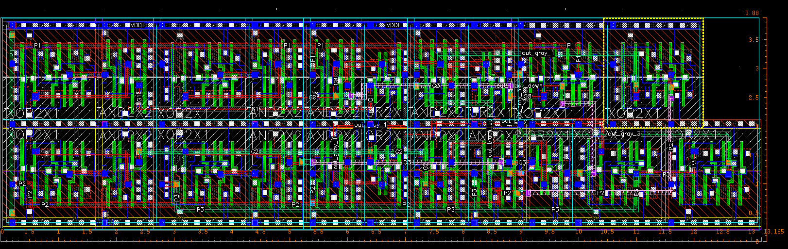
</p>

📄 **[Read the full report (PDF)](VLSI_ALU_Sklansky_Adder_Report.pdf)** — 31 pages, fully captioned, with every schematic, layout, and measurement screenshot.

## At a Glance

**4.27 GHz** f<sub>max</sub> @ 1.2 V · **2.04 GHz** f<sub>max</sub> @ 0.9 V ·
**52.29 µm²** adder cell area · **0** DRC violations · **0** LVS mismatches ·
all signal rise/fall times **< 50 ps** at both corners

The datapath latches three 4-bit two's-complement inputs, adds two of them
with a parallel-prefix adder, then subtracts the third by reusing the exact
same adder hardware — a small design that still needed a real signoff flow:
schematic → layout → DRC/LVS → post-layout timing, at two voltage corners.

## Architecture

<p align="center">
  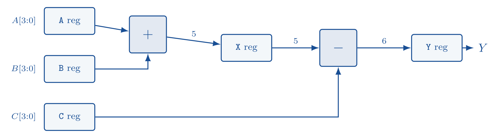
</p>

`A` and `B` are latched and added by the Sklansky adder into a 5-bit register
`X`; `C` is latched and subtracted from `X` by the *same* adder hardware
(reused via two's-complement inversion), producing the final 6-bit result `Y`.

| Block | Role |
|---|---|
| `4bit_register` | Input latches for `A`, `B`, `C` |
| `Adder` | 4-bit Sklansky parallel-prefix adder |
| `5bit_register` | Latches the partial sum `X = A + B` |
| `SUBTRACTOR` | Reuses the adder via two's-complement inversion for `X - C` |
| `6bit_register` | Latches the final signed result `Y` |

<p align="center">
  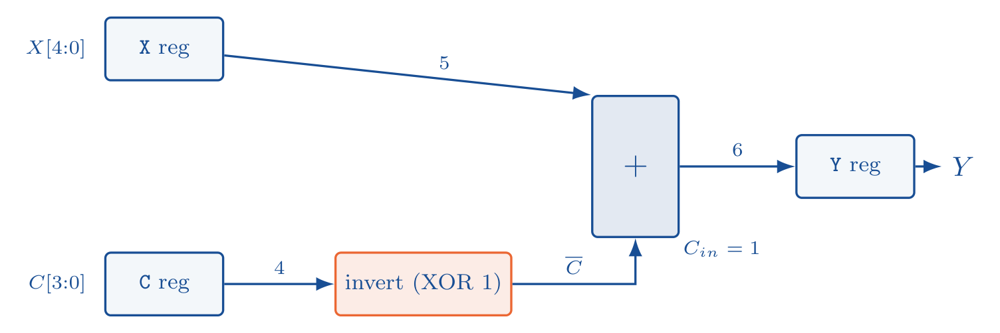
</p>

The subtractor is a clean example of hardware reuse: rather than building a
second arithmetic unit, `C`'s bits are inverted and fed into the *exact
same* adder used for `A + B`, with the carry-in tied high — `X + C̄ + 1 =
X − C`, for free.

## The Sklansky Adder

<p align="center">
  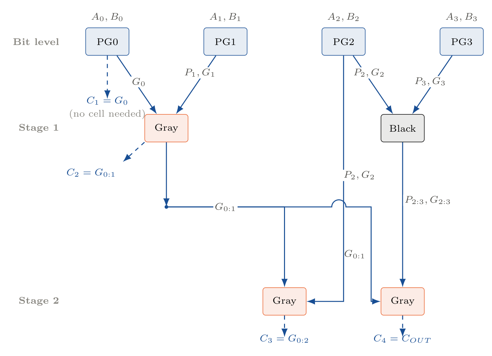
</p>

A **parallel prefix tree** computes every carry $C_i$ in $O(\log n)$ time
instead of rippling bit-by-bit through the word. The diagram above is
traced against the group's own gate-level netlist (`out_gray_1`,
`out_gray_2`, `out_gray_3` in [`assets/adder_schematic.png`](assets/adder_schematic.png)),
and it's worth noticing that $C_1$ needs **no cell at all** — bit 0's
generate signal *is* the carry into bit 1 — so the tree's worst-case depth
for a 4-bit word is really 2 stages (for $C_3$ and $C_4$), not a uniform 2
stages for every carry. The fan-out from the level-1 Gray cell into *both*
level-2 cells is what keeps that depth logarithmic instead of linear.

- **PG cell** — generates $P_i = A_i \oplus B_i$ and $G_i = A_i \cdot B_i$ per bit.
- **Black cell** — combines two adjacent group signals: $G_{group} = G_{left} + (P_{left} \cdot G_{right})$, $P_{group} = P_{left} \cdot P_{right}$.
- **Gray cell** — an optimized black cell producing only the group *generate* signal, trimming area/wiring where the group propagate is never needed downstream.

| PG cell | Gray cell | Black cell |
|---|---|---|
| 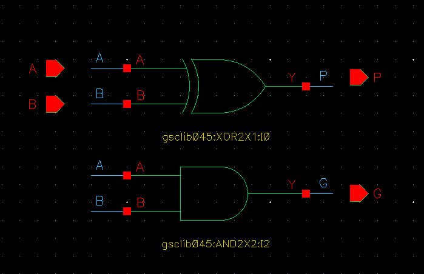 | 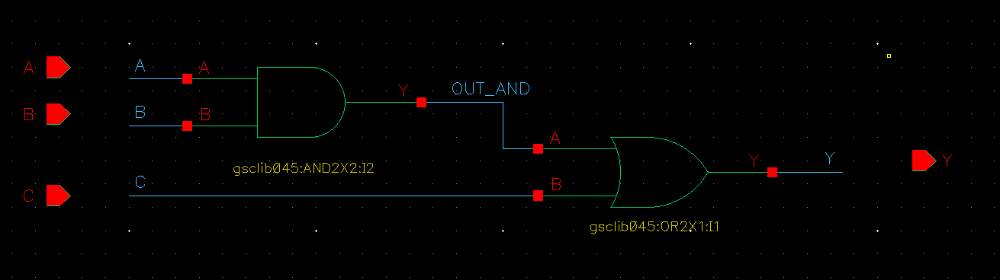 | 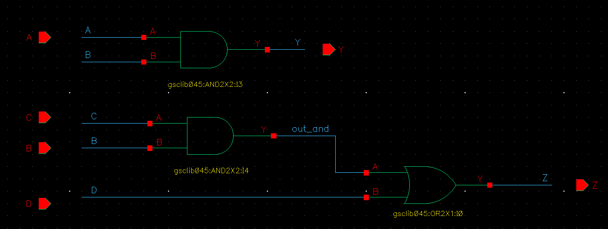 |
| 1× XOR + 1× AND | 1× AND + 1× OR | 2× AND + 1× OR |

For 4 bits this tree is only **2 levels deep** — faster than a ripple-carry
adder's $O(n)$ delay, with less wiring than a Kogge-Stone tree for the same
width.

**Gate-level area budget** (measured from the actual standard cells used):

| Cell | Count | Area each (µm²) | Total (µm²) |
|---|---|---|---|
| AND | 9 | 2.128 | 19.152 |
| OR | 4 | 1.748 | 6.992 |
| XOR | 8 | 3.268 | 26.144 |
| **Total** | **21** | — | **52.288** |

<p align="center">
  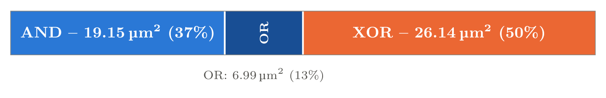
</p>

XOR gates dominate the area at half the total, despite AND contributing
more individual instances (9 vs. 8) — every PG cell needs one, and so does
every final sum bit.

## Physical Layout

<p align="center">
  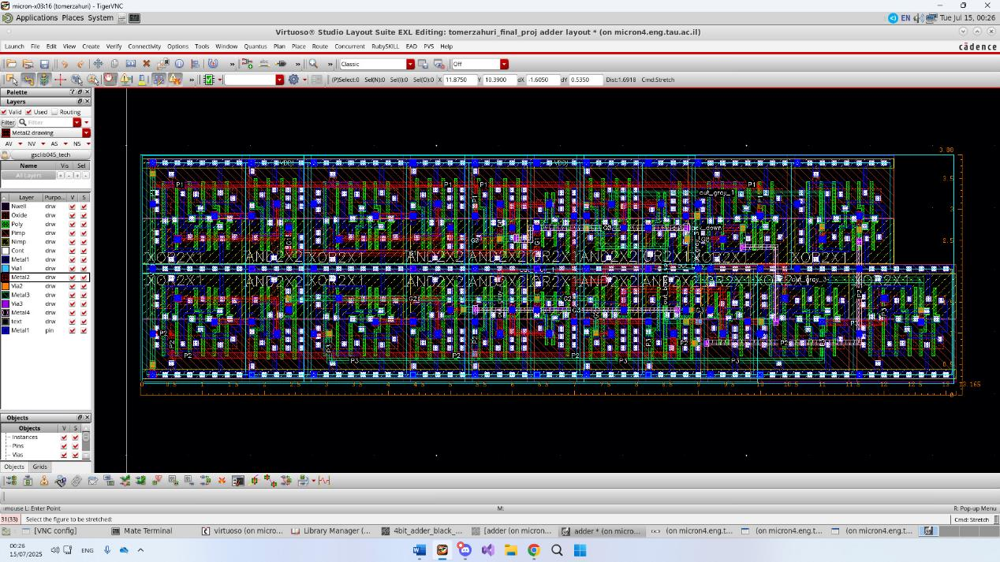
</p>
<p align="center">
  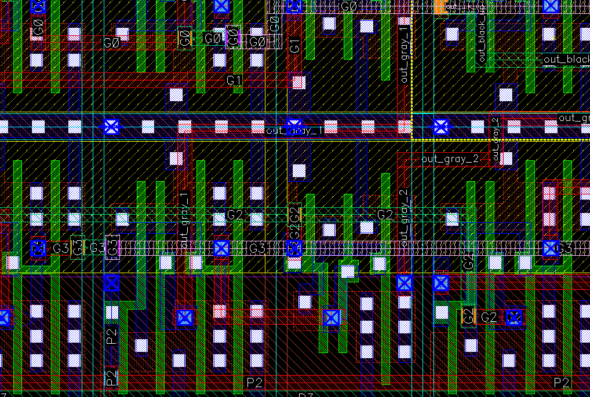
</p>

Two rows of `4bit_adder_pg` / `4bit_adder_gray_cell` / `4bit_adder_black_Cell`
cells feed a final `XOR2X1` row that produces the sum bits — the layout
mirrors the gate-level floor plan directly.

## Verification: DRC & LVS

<p align="center">
  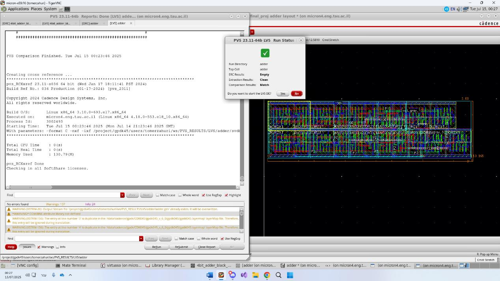
  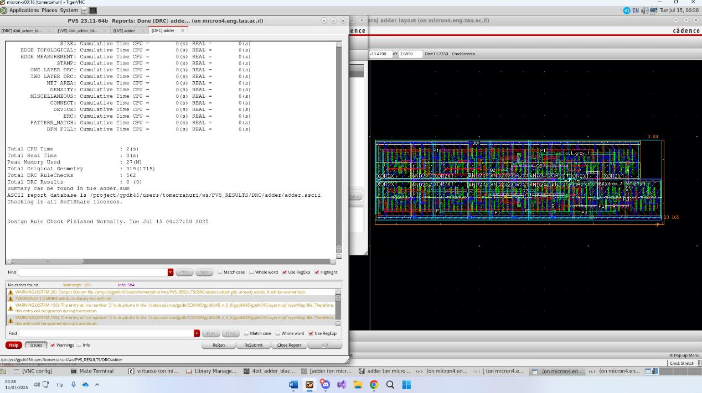
</p>

Design Rule Checking confirms every wire and device satisfies the
fabrication process's geometric rules; Layout-Versus-Schematic extracts the
transistor-level netlist from the layout and diffs it against the original
schematic. **Both passed clean — 0 violations, 0 netlist mismatches.**

## Functional Verification

<p align="center">
  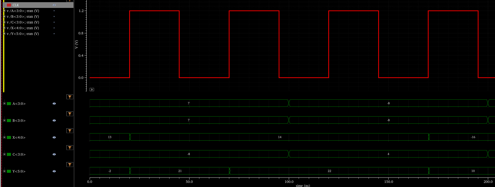
</p>

The adder and subtractor were verified independently against dedicated
testbenches before exercising the full ALU end-to-end, including a
signed-overflow boundary test at the design's largest and smallest
representable results (−23 and +22). The three annotated clock edges above
mark: **1st** — `A`/`B` latched into their input registers; **2nd** — the
partial sum latched into `X`; **3rd** — the final result, after subtracting
`C`, latched into `Y`.

## Timing: Critical Path & Voltage Impact

<p align="center">
  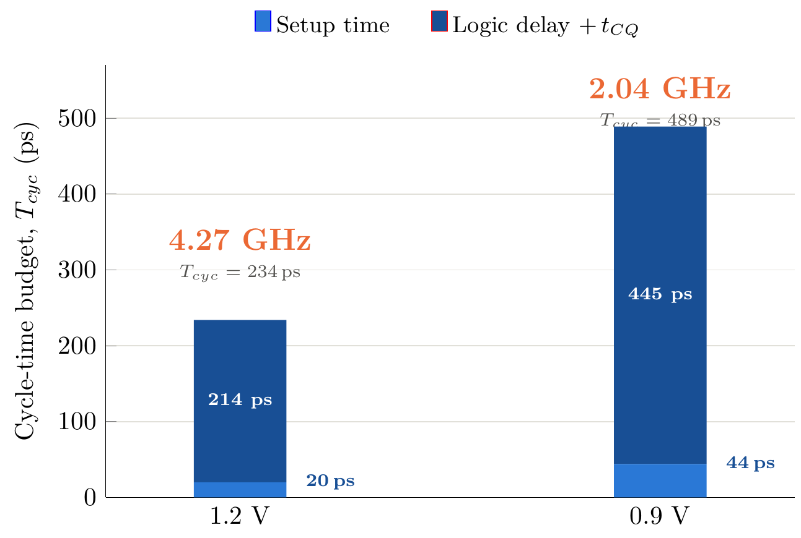
</p>

Rather than just showing the fmax outcome, each bar above is literally
$T_{cyc} = T_{setup} + (t_{cq} + t_{sub,max})$, stacked to show *where the
time actually goes*: both components grow at the lower supply, not just
the logic delay — reduced drive current slows the flip-flops themselves
too — and that combined growth is what nearly doubles the cycle time.

Setup time and the subtractor's carry-out settling delay were measured
directly in Spectre by sweeping a programmable delay and locating the
capture boundary, at both supply corners:

| Corner | Setup time | Combined logic + t<sub>CQ</sub> | Cycle time | f<sub>max</sub> |
|---|---|---|---|---|
| 1.2 V | ≈20 ps | 0.2143 ns | 0.2343 ns | **4.27 GHz** |
| 0.9 V | ≈44 ps | 0.4453 ns | 0.4893 ns | **2.04 GHz** |

Every signal's rise and fall time (10–90%) was also confirmed under 50 ps at
both corners, with wide margin.

## Part 2 — Ring Oscillator Clock Generation

<p align="center">
  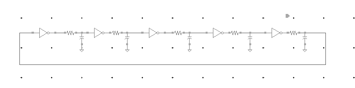
</p>

An independent exercise in the same report: a 5-stage inverter ring
oscillator, exploring how frequency trades off against inverter sizing and
output loading.

| Question | Finding |
|---|---|
| Bigger inverters? | Higher drive strength → lower per-stage delay → **higher** $f_{osc}$ |
| Added RC chains? | More load per stage → **lower** $f_{osc}$ |
| Output capacitor added? | $f_{osc}$: 2.5 MHz → 2.46 MHz; rail-to-rail swing narrowed, edges softened |
| Switched INXV1 → INXV2? | Full swing restored, sharp edges, $f_{osc}$ **increased** above the loaded baseline |

## Repository Structure

```
├── report.tex                          LaTeX source for the full report
├── VLSI_ALU_Sklansky_Adder_Report.pdf  Compiled 31-page report
├── assets/                             Every schematic, layout, and waveform figure
└── README.md
```

## Team

Amit Damari · Tomer Zahuri · Tal Franco · Israel Elmaliach

## License

MIT — see [LICENSE](LICENSE).
